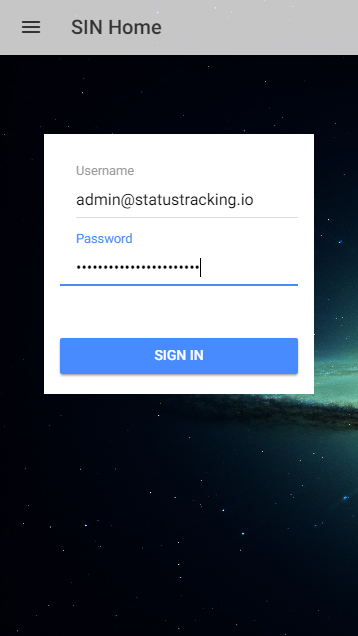
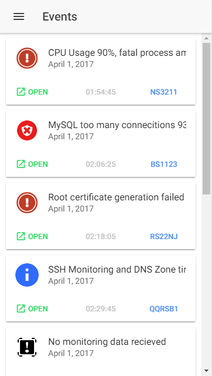
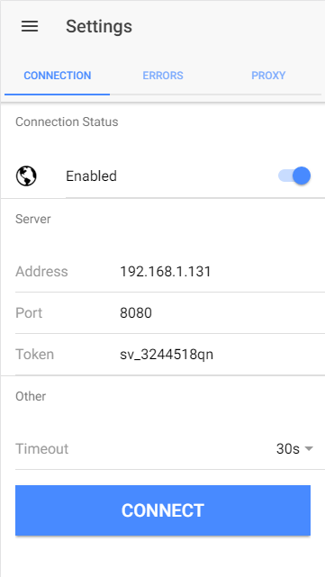
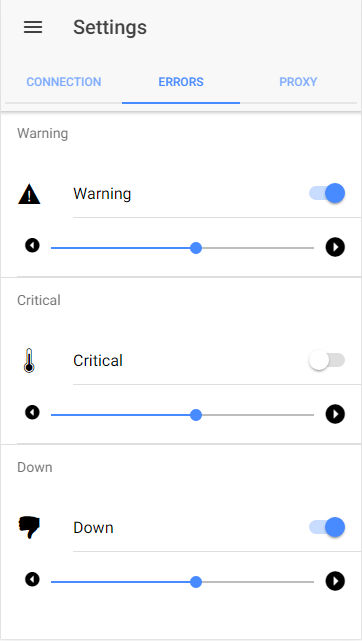
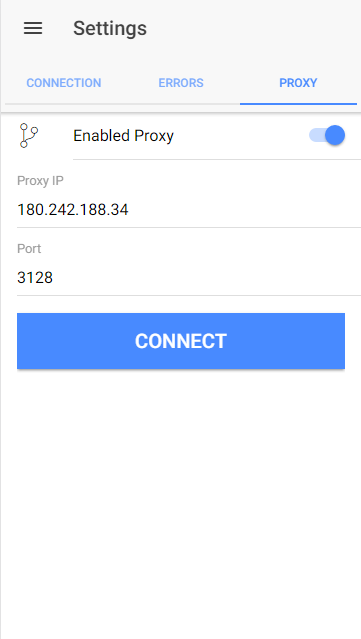

# Server Issue Tracker
> Issue tracker app from external API 

> Created and designed by Krasimir Velichkov using the Ionic 2 Framework

## Status
Currently the applicaiton is still in prototype mode.

